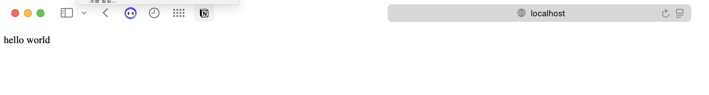
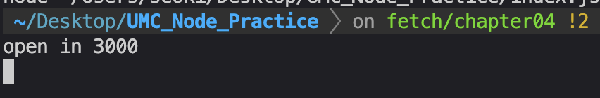
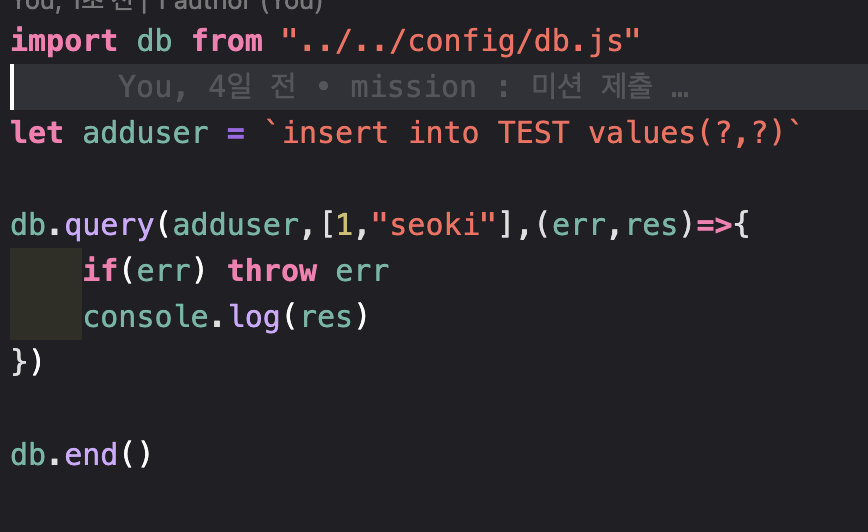
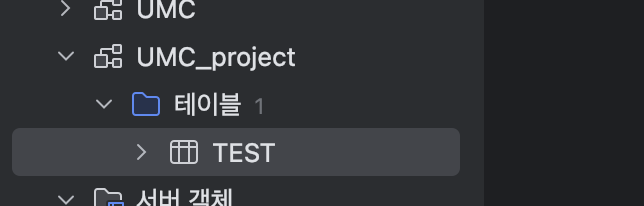
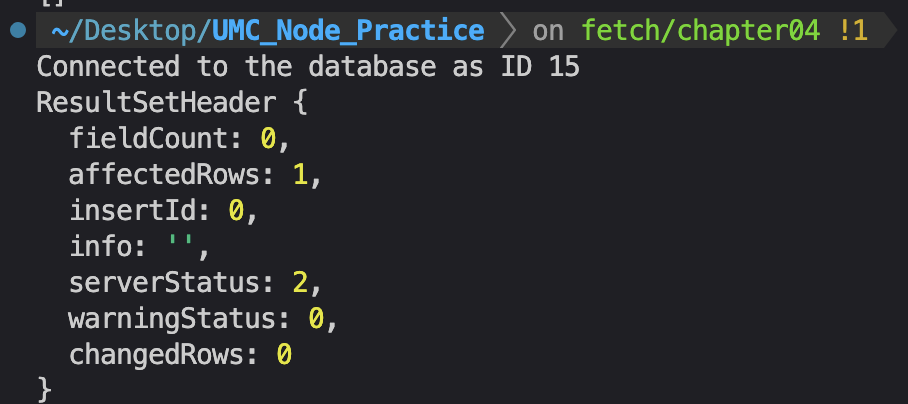
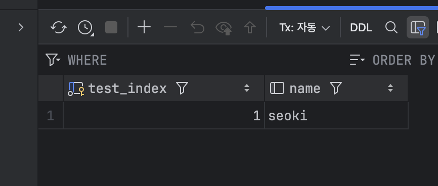

<https://velog.io/@seoki180/UMC-ES6-%EB%AA%A8%EB%93%88%EA%B3%BC-%EC%86%8C%ED%94%84%ED%8A%B8%EC%9B%A8%EC%96%B4-%EC%95%84%ED%82%A4%ED%85%8D%EC%B3%90>
시니어 블로그

<https://github.com/seoki180/UMC_Node_Practice.git>
테스트 레포지토리

---

express 서버 띄우기

TEST insert query생성

TEST DB 생성

DB insert Test

DB삽입 성공
w
