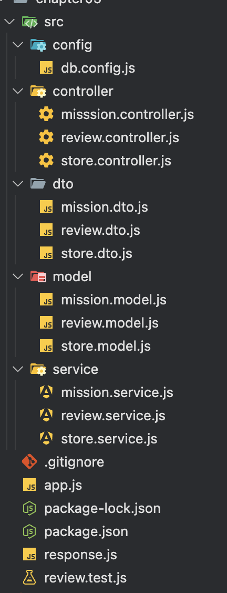
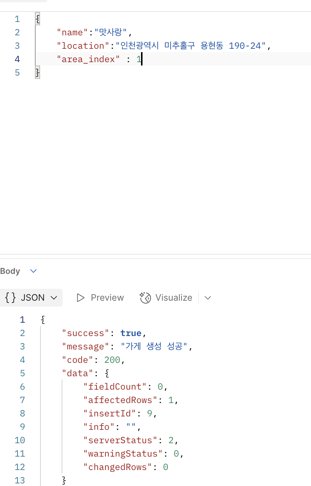
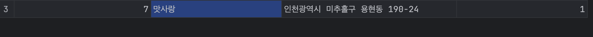
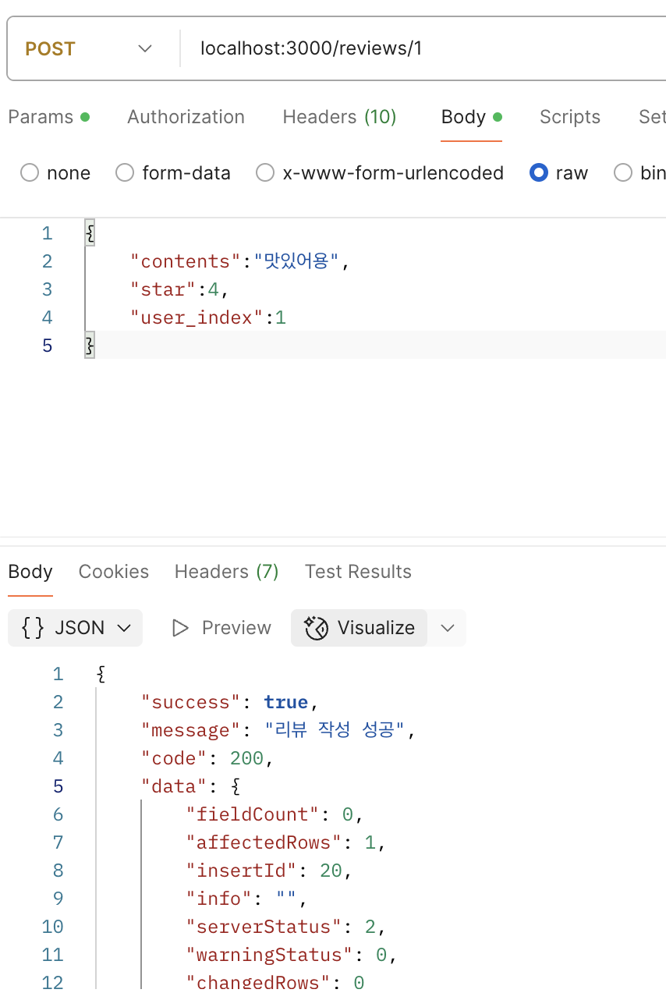
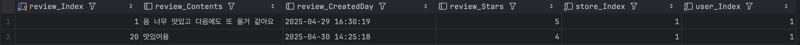
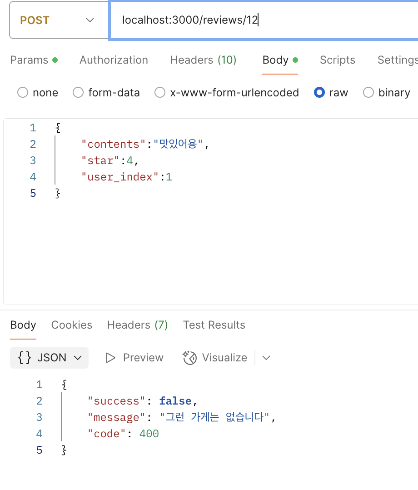
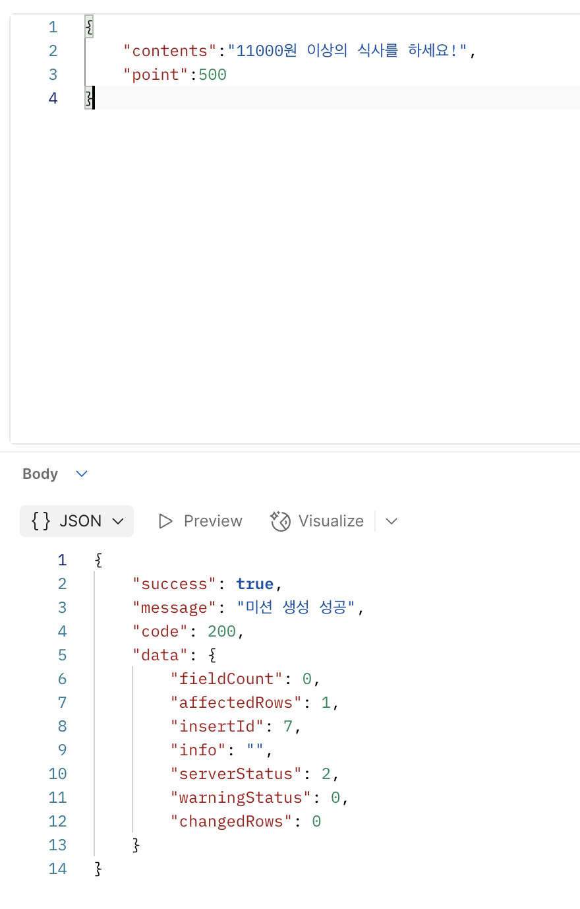
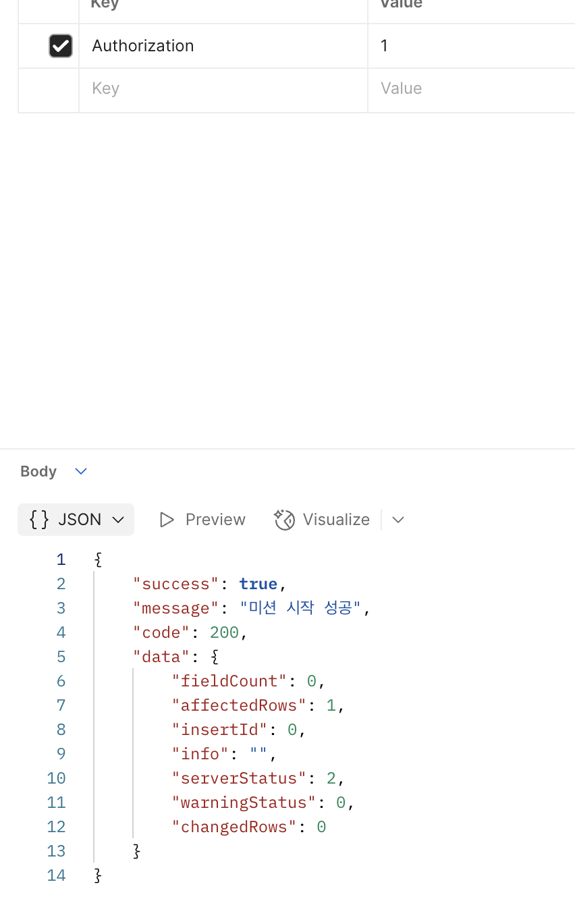
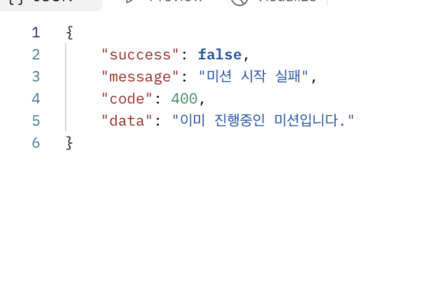
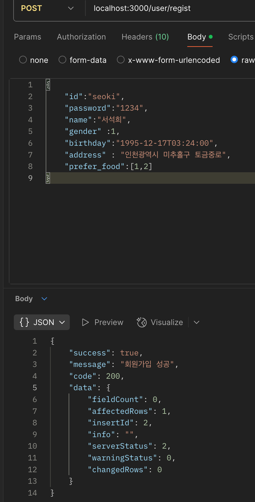

# <https://github.com/seoki180/UMC_Node_Practice.git>

1. 특정 지역에 가게 추가하기 API
    - POST /store
    - 필요한 정보
    1. 가게 이름
    2. 위치 인덱스

2. **가게에 리뷰 추가하기 API**
    - 리뷰를 추가하려는 가게가 존재하는지 검증이 필요합니다.
    - POST /review/{store_index}
    - 필요한 정보
    1. 가게 인덱스
    2. 유저 인덱스
    3. 리뷰 내용
    4. 리뷰 별점
    5. 리뷰 작성 시간

3. 가게에 미션 추가하기 API
    - POST /misison/{store_index}/add
    - 필요한 정보
    1. 가게 인덱스
    2. 미션 내용
    3. 미션 포인트

4. **가게의 미션을 도전 중인 미션에 추가(미션 도전하기) API**
    - 도전하려는 미션이 이미 도전 중이지는 않은지 검증이 필요합니다.
    - 3번 API를 구현하지 않은 경우, 4번에서는 DB에 미션 정보를 수동으로 기입한 후 진행해야 합니다.
    - POST /mission/{mission_index}/start
    - 필요한 정보
    1. 미션 인덱스
    2. 유저 인덱스

5. **회원가입 API**
    - 회원가입
    - 필요한정보
    1. 유저 아이디
    2. 유저 비밀번호
    3. 유저 이름
    4. 유저 주소
    5. 유저 성별
    6. 유저 생일
    7. 유저 선호 음식

# 파일 구조



각 엔드포인트 마다 컨트롤러 - 서비스 - 모델 DTO를 설계했다

## 1번 미션 실행

성공



req.body eg)

```
{
    "name":"맛사랑",
    "location":"인천광역시 미추홀구 용현동 190-24",
    "area_index": 1
}
```

## 2번 미션 실행

성공시




req.body eg)

```
{
    "contents":"음 너무 맛있고 다음에도 또 올거 같아요",
    "star":4
}
```

req.header => user token

실패시

존재하지 않는 가게로 접근하면 리뷰 작성에 실패한다

## 3번 미션 실행



req.body eg)

```
{
    "contents":"11000원 이상의 식사를 하세요!",
    "point":500
}
```

req.header => user token

실패시

## 4번 미션 실행



실패시


## 5번 미션 실행


