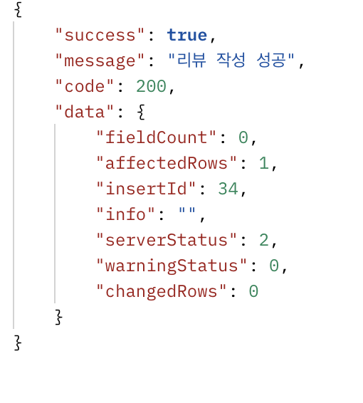
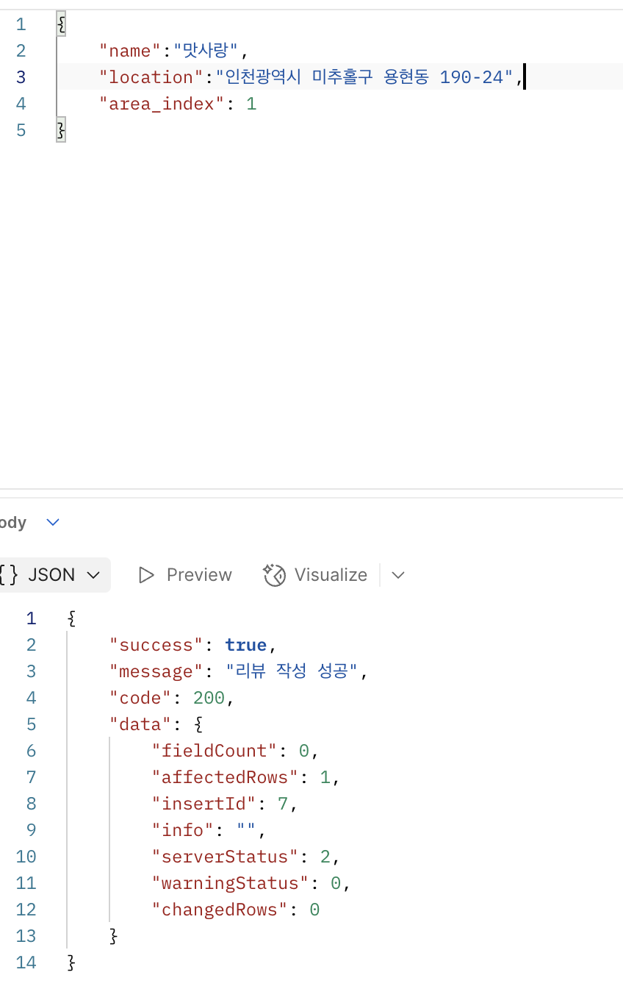

1. 특정 지역에 가게 추가하기 API
    - POST /store/{locaion_index}

2. **가게에 리뷰 추가하기 API**
    - 리뷰를 추가하려는 가게가 존재하는지 검증이 필요합니다.
    - POST /review/{store_index}

3. 가게에 미션 추가하기 API
    - POST /misison/{store_index}/add

4. **가게의 미션을 도전 중인 미션에 추가(미션 도전하기) API**
    - 도전하려는 미션이 이미 도전 중이지는 않은지 검증이 필요합니다.
    - 3번 API를 구현하지 않은 경우, 4번에서는 DB에 미션 정보를 수동으로 기입한 후 진행해야 합니다.
    - POST /mission/{mission_index}/start

3주차 API 명세서

## contorller

## DTO

## service

## repository

