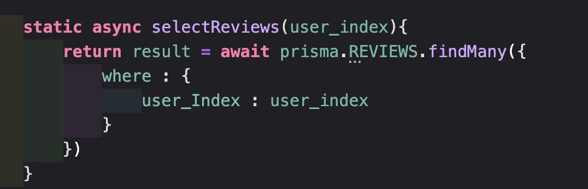
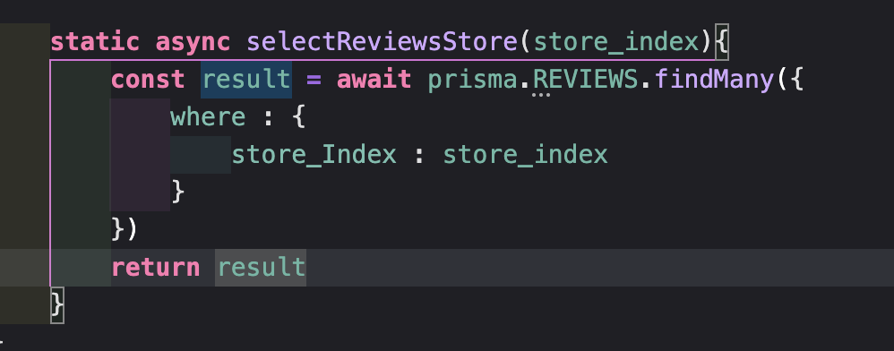
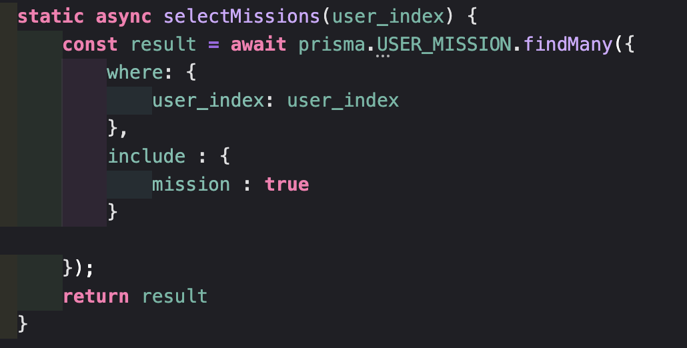
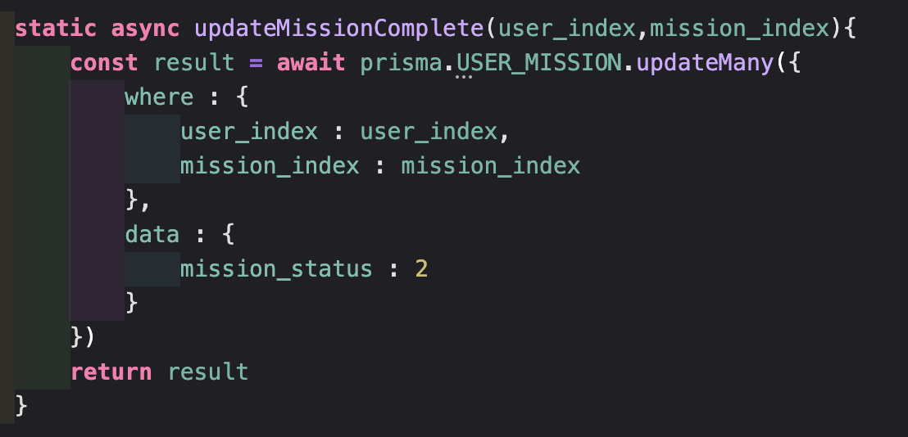

1. 기존에 구현했던 API의 Repository 함수들을 모두 Prisma ORM을 이용하도록 변경해주세요.
2. 내가 작성한 리뷰 목록
    - 참고 화면

        

    

3. 특정 가게의 미션 목록

    

4. 내가 진행 중인 미션 목록

    

5. 내가 진행 중인 미션을 진행 완료로 바꾸기
    - 참고 화면

        

    
