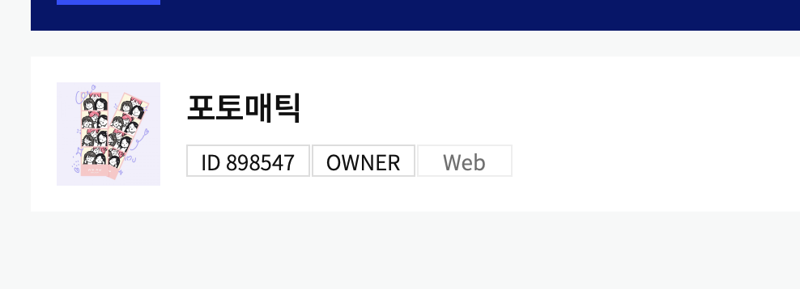
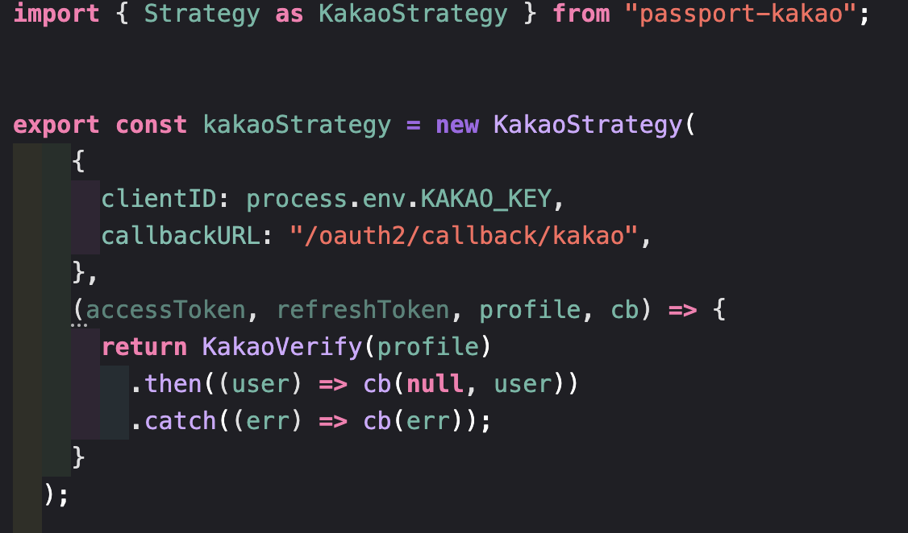
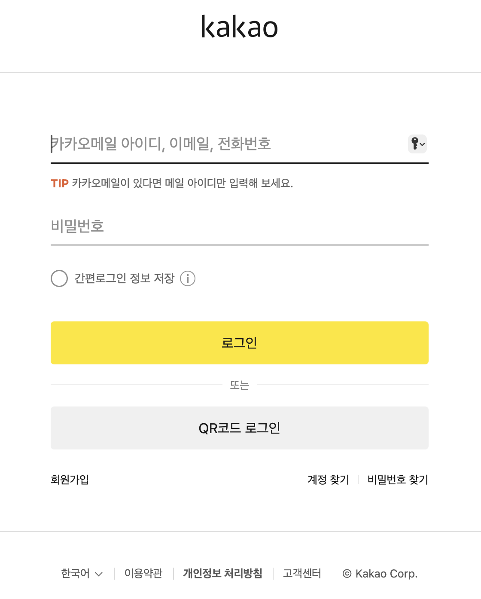
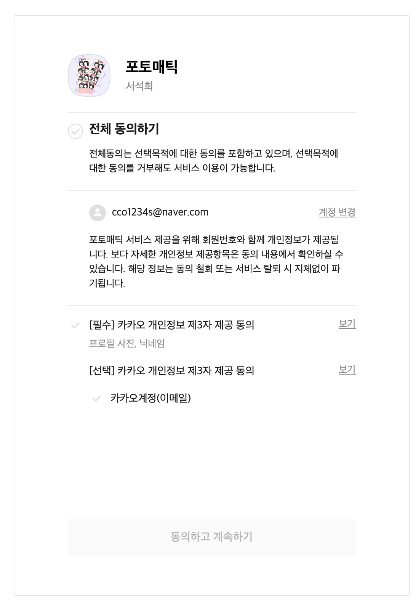
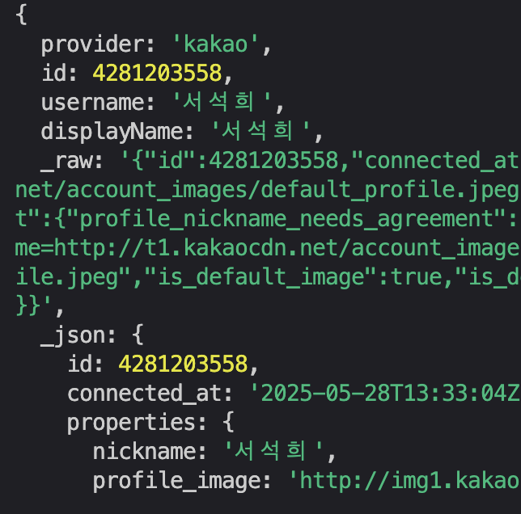
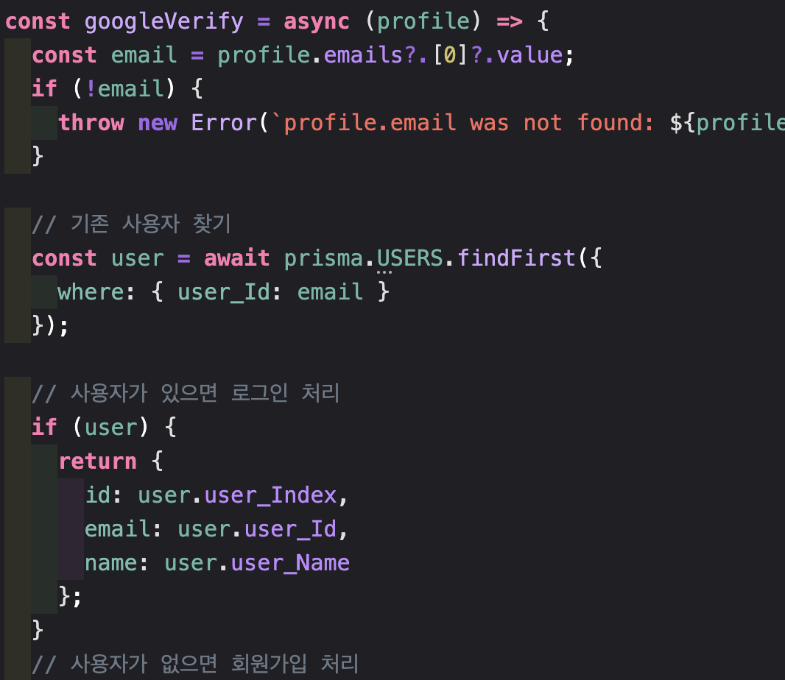
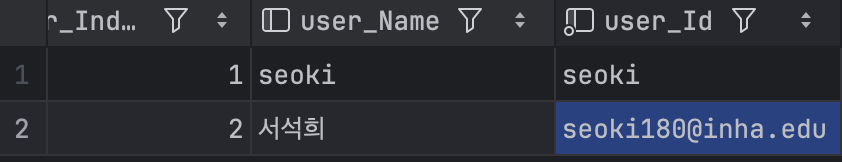
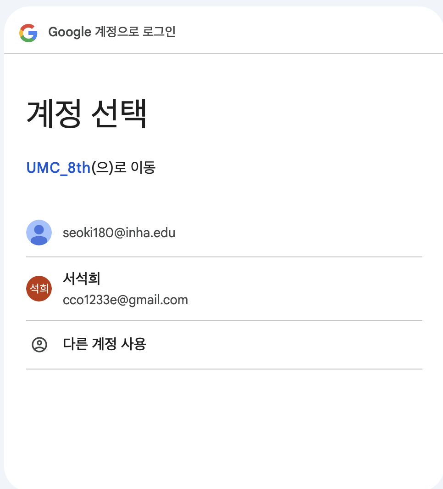
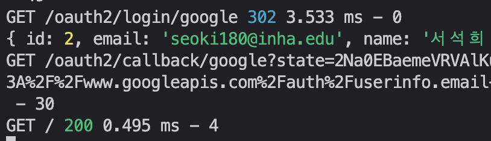
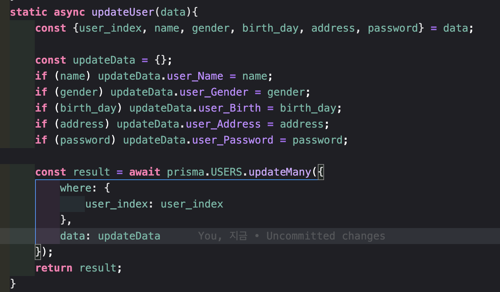

1. 이번 주에는 Google 로그인 외에 다른 소셜 로그인을 하나 더 연동해주세요! 네이버 로그인, 카카오 로그인, Apple 로그인, GitHub 로그인 등 원하시는 로그인 방식을 연동해주시면 됩니다.

   카카오 로그인을 구현해보았다.

   1. 우선 카카오 디벨로퍼 사이트에서 앱을 등록한다. 나는 예전에 했던 프로젝트가 있어서 그 애플리케이션을 사용했다.
      
   2. 카카오 로그인을 설정하고, REST API KEY를 .env파일에 추가한다.
   3. 이미 npm 의존성 passport-kakao을 설치한다.
   4. 구글과 동일하게 kakaoStrategy를 선언하고 passport에 등록한다.

      
   5. 
   6. 
   7. 
   8. 
2. 기존에 사용자의 정보를 하드 코딩 했던 부분들이 있다면 수정해주세요! **(ex. 항상 첫 번째 사용자를 가져와 이용했던 부분 등)**

    로그인 할 떄 profile 정보를 받아와 database에 해당 email로 가입 한 정보가 있는지 확인하고 있다면 값을 return 해주고, 없다면 오류를 생성하는 로직을 구현했다.

3. 기존 회원 가입 API의 경우, 이메일이 이미 존재하는 사용자는 회원 가입을 막아둔 상태입니다. 일단 Google 로그인 등으로 로그인 한 사용자의 경우 전화번호, 생일 등을 채울 마땅한 방법이 없는 상태입니다.
   user router 아래 update endpoint를 추가하는 로직을 추가했다.

* 
