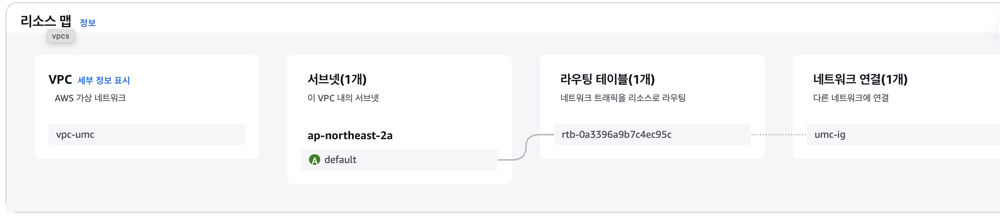
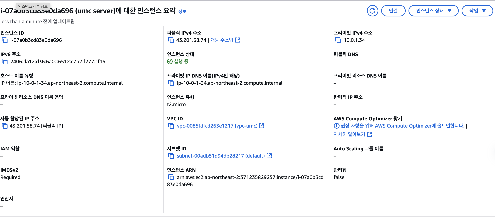

VPC 설정



EC2


---

시니어 미션


## Docker란?

소프트웨어가 어느 환경에서든 동일하게 동작할 수 있도록 보장해주는 오픈소스 시스템

docker container → 화물 컨테이너 박스, 박스 안은 외부와 완전히 독립됨

application → 컨테이너 내부에 있는 상품, 앱, 라이브러리, os등 필요한 모든게 담겨있음

→ application도 실행환경에 따라 돌아가지 않을 수 있음 → container로 안전하게 포장한다면 어딜 가든 container 내부 상품은 어느 환경에나 똑같이 돌아가는 것이 보장된다.

한 컴퓨터에서도 여러 container를 동시에 실행 할 수 있고, 컨테이너간은 서로 격리되어 영향을 주지 않는다.

```jsx
# Node.js 베이스 이미지 사용
FROM node:22-alpine
# 작업 디렉토리 설정
WORKDIR /app

# package.json과 package-lock.json 복사
COPY package*.json ./

# 의존성 설치
RUN npm ci

# 소스 코드 복사
COPY . .

# Prisma 클라이언트 생성
RUN npx prisma generate

# 포트 노출
EXPOSE 3000

# 애플리케이션 실행
CMD ["npm", "start"] 
```

docker build를 실행하면 해당 docker file을 바탕으로 이미지를 생성한다.


빌드중


생성된 이미지

```jsx
docker run --name UMC --rm -it -p 3000:3000 --env-file /Users/seoki/Desktop/UMC_Node_Practice/.env umc
```

생성된 이미지를 바탕으로 docker를 실행시킬수 있다

옵션

* —name : 실행될 container 이름을 명시해준다
* —rm  : container 가 종료될때 바로 삭제한다
* -it : 실행과 현재 실행 terminal을 attach한다.
* -p : docker container 의 Port와 외부포트를 포워딩한다
* —env-file : 도커 컨테이너 내부에 환경변수 파일을 추가한다.

## Trouble Shooting

Prisma가 포함된 Node 프로젝트를 build하는데 문제가 많이 발생했다.

1. 현재 내 로컬개발환경이 mac os라 일반 prisma engine이 os마다 달라서 그대로 빌드하게 되면 docker container내에서 문제가 발생했다. 따라서 prisma에 옵션을 추가해야했다.


1. npx prisma generate 를 먼저 시행하면 해당 명령을 수행 할 시점에 env파일이 존재하지 않아 오류가 발생했다. 따라서 npx prisma generate를 먼저 시행하지 않고 npm run 명령어에 해당 명령어를 추가해서 docker file을 수정했다.
2. —env-file로 env파일을 넘겨주고 env 환경변수도 등록된것을 확인했는데 prisma 에서 환경변수를 못받아오는 문제가 발생했다. 따라서 임시책으로 Dockerignore에 추가해놨던 env를 제거하고 image자체에 env파일을 담아서 build했다. 보안상으로 큰 문제가 있어보여 추후 수정이 필요해 보인다.


